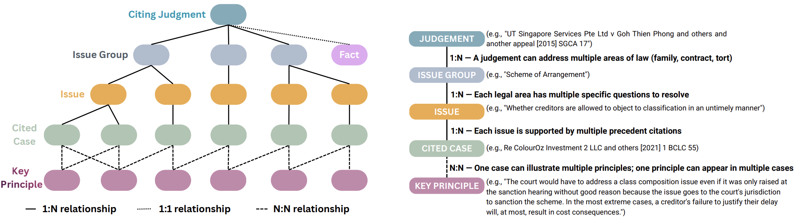
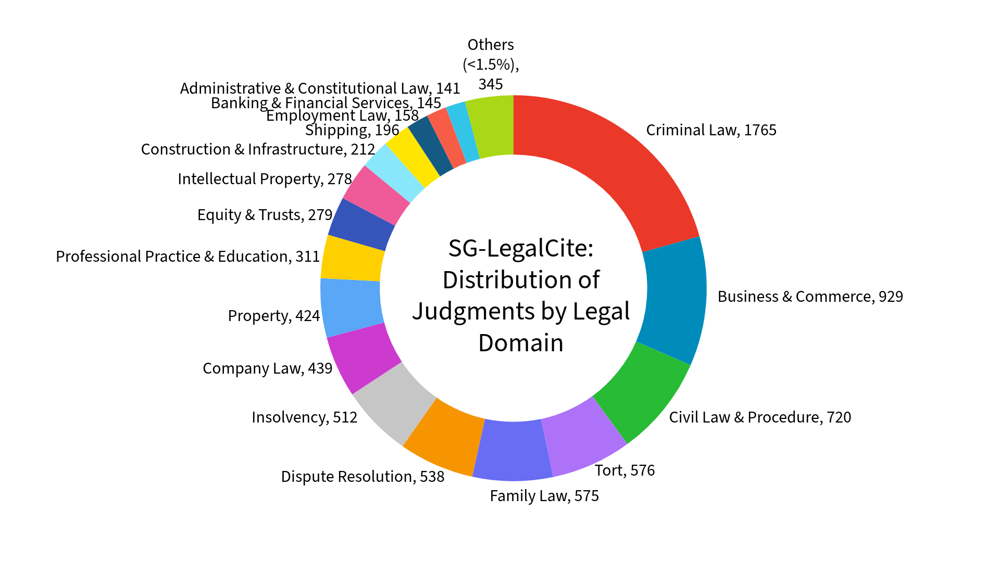
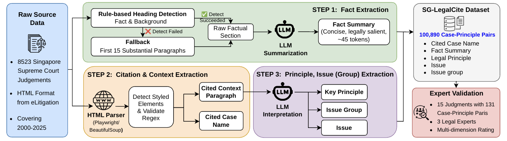

# SG-LegalCite: A Principle-Augmented Benchmark for Legal Citation Retrieval in Singapore Law

**Paper:** *SG-LegalCite: A Principle-Augmented Benchmark for Legal Citation Retrieval in Singapore Law*

**Dataset:** [HuggingFace](https://huggingface.co/datasets/anonymousmeowmeow/SG-LegalCite) | **Paper:** [[arXiv / ACL Anthology link]](#)

---

## Overview

SG-LegalCite is the **first legal citation retrieval benchmark for Singapore law** and the **first benchmark to integrate explicit legal principles into the retrieval query** across existing legal retrieval datasets.

In common-law systems, legal citation depends not only on factual similarity, but also on the **legal principle** for which a precedent is invoked. Existing benchmarks use case facts, citation context, or full judgments as queries, where the governing legal principle is often missing, only implicitly expressed, or entangled with broader context. As a result, models may retrieve precedents that are factually similar yet doctrinally irrelevant.

SG-LegalCite operationalises a new retrieval paradigm where cited cases are ranked based on queries that integrate case facts with explicit legal principles:

**[FACT]** *case facts* + **[PRINCIPLE]** *legal principle* → *cited case*

This formulation is particularly important for Singapore, where the legal system has evolved independently: only domestic precedents are binding, while foreign authorities serve merely as persuasive references.

The dataset is extracted from 8,523 Singapore Supreme Court judgments (2000–2025) using a cost-effective LLM pipeline (DeepSeek-V3 with 15-shot prompting) validated by three legal experts from Singapore law schools.

---

## Repository Structure

```text
SG-LegalCite/
├── dataset/
│   └── README.md                                # Dataset format, field descriptions, and download link
├── code/
│   ├── extraction/
│   │   ├── 00_Generate_Case_Index.py            # Step 0: Generate master case URL index (2000–2025)
│   │   ├── 01_Extract_Cited_Cases_Batch.py      # Step 1: Extract cited cases + paragraph context
│   │   ├── 02_Deepseek_Chat_Batch.py            # Step 2: Extract Key Principles, Issue, Issue Group
│   │   ├── 03_Fact_Query_Batch.py               # Step 3: Generate lawyer-style Fact_Query summaries
│   │   ├── 04_Final_Concatenation_Batch.py      # Step 4: Add Case Name + Precedential Weight
│   │   ├── Scrape Cited Case Judgements Pipeline.py    # Scrape full judgment text for cited cases
│   │   ├── prompt_with_paragraphs_FINAL.txt     # 15-shot DeepSeek extraction prompt
│   │   ├── LLM Selection/
│   │   │   ├── LLM_Selection_KeyPrinciples_All_Models.ipynb    # LLM comparison evaluation notebook
│   │   │   ├── LLM_Selection_KeyPrinciples_Results.xlsx        # Accuracy summary (Claude/DeepSeek/GPT-4o)
│   │   │   ├── Claude Sonnet 4_individual_key_principle_extraction_results/
│   │   │   ├── DeepSeek-Chat_individual_key_principle_extraction_results/
│   │   │   └── GPT-4o_individual_key_principle_extraction_results/
│   │   └── Few-Shot Experiments (DeepSeek-Chat)/
│   │       ├── FewShot_Experiments_DeepSeek.ipynb              # Few-shot evaluation notebook
│   │       ├── FewShot_KeyPrinciples_Issue_Results.xlsx        # Accuracy summary (0/5/10/15/20-shot)
│   │       └── {Zero,5,10,15,20}-Shot_individual_*_extraction_results/
│   │
│   ├── retrieval/                               # Main results — fact-only vs principle-augmented
│   │   ├── generate_stage2_direct_pools_v2.py           # Pool generation: fact-only baseline
│   │   ├── generate_stage2_single_stage_pools_v2.py     # Pool generation: principle-augmented
│   │   ├── sbert_direct_v2v5.py                         # SBERT (fact-only)
│   │   ├── sbert_single_stage_v1.py                     # SBERT (principle-augmented)
│   │   ├── customlegalbert_direct_v1.py                 # Custom Legal-BERT (fact-only)
│   │   ├── customlegalbert_single_stage_v1.py           # Custom Legal-BERT (principle-augmented)
│   │   ├── longformer_direct_v1.py                      # Legal-Longformer (fact-only)
│   │   ├── longformer_single_stage_v1.py                # Legal-Longformer (principle-augmented)
│   │   ├── pileoflaw_direct_v1.py                       # Pile-of-Law BERT (fact-only)
│   │   ├── pileoflaw_single_stage_v2.py                 # Pile-of-Law BERT (principle-augmented)
│   │   ├── roberta_large_direct_v1.py                   # Legal-English-RoBERTa (fact-only)
│   │   ├── roberta_large_single_stage_v1.py             # Legal-English-RoBERTa (principle-augmented)
│   │   ├── sailer_direct_v1.py                          # SAILER (fact-only)
│   │   ├── sailer_single_stage_v1.py                    # SAILER (principle-augmented)
│   │   ├── adaptllm_direct_v1.py                        # AdaptLLM (fact-only)
│   │   ├── adaptllm_single_stage_v2.py                  # AdaptLLM (principle-augmented)
│   │   ├── legalbert_stage2_direct_v2.py                # Legal-BERT (fact-only)
│   │   ├── legalbert_single_stage.py                    # Legal-BERT (principle-augmented)
│   │   ├── saullm_direct_v2.py                          # SaulLM-7B (fact-only)
│   │   ├── saullm_single_stage_v1.py                    # SaulLM-7B (principle-augmented)
│   │   ├── lawma_direct_v3.py                           # Lawma-8B (fact-only)
│   │   ├── lawma_single_stage_v2.py                     # Lawma-8B (principle-augmented)
│   │   └── run_*.pbs                                    # PBS job scripts for HPC cluster
│   │
│   ├── Field Granularity Ablation/              # Section 5.3 — fact + {issue, issue_group, all fields}
│   │   ├── generate_stage2_fact_issue_pools_v1.py
│   │   ├── generate_stage2_fact_issue_group_pools_v1.py
│   │   ├── generate_stage2_all_fields_pools_v3.py
│   │   ├── run_generate_fact_issue_pools_v1.pbs
│   │   ├── run_generate_fact_issue_group_pools_v1.pbs
│   │   ├── run_generate_all_fields_pools_v3.pbs
│   │   ├── sbert_fact_issue_v1.py
│   │   ├── sbert_fact_issue_group_v1.py
│   │   ├── sbert_all_fields_v2.py
│   │   ├── saullm_fact_issue_v1.py
│   │   ├── saullm_fact_issue_group_v1.py
│   │   ├── saullm_all_fields_v17.py
│   │   ├── run_sbert_fact_issue_v1.pbs
│   │   ├── run_sbert_fact_issue_group_v1.pbs
│   │   ├── run_sbert_all_fields_v2.pbs
│   │   ├── run_saullm_fact_issue_v1.pbs
│   │   ├── run_saullm_fact_issue_group_v1.pbs
│   │   └── run_saullm_all_fields_v17.pbs
│   │
│   ├── Context Ablation/                        # Section 5.3 — scrubbed ±200-word citation window
│   │   ├── 06_Build_Scrubbed_Paragraph_Window.ipynb     # Notebook: build scrubbed window CSV
│   │   ├── generate_stage2_paragraph_pools_v2.py        # Pool generation: paragraph-augmented
│   │   ├── run_generate_stage2_paragraph_pools_v2.pbs
│   │   ├── sbert_paragraph_v11.py                       # SBERT with scrubbed paragraph
│   │   ├── saullm_paragraph_v5.py                       # SaulLM-7B with scrubbed paragraph
│   │   ├── run_sbert_paragraph_v11.pbs
│   │   └── run_saullm_paragraph_v5.pbs
│   │
│   └── Cold-Start Evaluation/                   # Section 5.3 — DeepSeek-predicted principle
│       ├── run_coldstart_experiment_v4.py               # DeepSeek principle predictor + SaulLM eval
│       └── run_coldstart_experiment_v4.pbs
│
├── img/
│   ├── Pipeline.png                             # Dataset construction pipeline figure
│   ├── legal_hierarchy_combined.png             # Data schema: judgment → issue group → issue → cited case → principle
│   └── domain-distribution.png                  # Distribution of judgments across legal domains
├── .gitignore
├── LICENSE
└── README.md
```

---

## Data Schema

<p align="center">
  
</p>

Each judgment contributes one shared **Fact** field and refers to multiple individual citations, each associated with its own **Key Principle**, **Cited Case**, **Issue**, and **Issue Group**. The hierarchy reflects the process of legal reasoning: facts describe the dispute as a whole, while individual citations are invoked for legal principles relevant to particular aspects of that dispute.

Relationships:
- **Judgment → Issue Group** (1:N) — A judgment can address multiple areas of law (e.g., family, contract, tort).
- **Issue Group → Issue** (1:N) — Each legal area has multiple specific questions to resolve.
- **Issue → Cited Case** (1:N) — Each issue is supported by multiple precedent citations.
- **Cited Case ↔ Key Principle** (N:N) — One case can illustrate multiple principles; one principle can appear in multiple cases.
- **Judgment → Fact** (1:1) — Each judgment has a single factual background.

---

## Dataset Statistics

| Attribute | Value |
|---|---|
| Time Span | 2000–2025 |
| Unique Judgments | 8,523 |
| Case–Principle Pairs | 100,890 |
| Unique Principles | 72,500 |
| Unique Cited Cases | 48,478 |
| Unique Issues | 86,519 |
| Unique Issue Groups | 9,748 |
| Avg. Raw Fact Length | 1,034.4 tokens |
| Avg. Fact Length (post-summary) | 45.1 tokens |
| Avg. Citation Paragraph Length | 1,100.5 tokens |
| Avg. Principle Length | 69.9 tokens |

Each record is a triplet **(f, k, c)**:
- **f** — Factual background of the citing judgment (LLM-summarised to ~45 tokens)
- **k** — Legal principle for which the precedent is cited
- **c** — Cited Singapore Supreme Court case

Each judgment is uniquely identified by `Judgment_URL`, which corresponds 1:1 with the Singapore neutral citation (`Judgment_Reference`) of the citing judgment (e.g., `https://www.elitigation.sg/gd/s/2023_SGCA_15` ↔ `[2023] SGCA 15`).

### Domain Distribution

<p align="center">
  
</p>

All 8,523 judgments are classified against the 34 practice-area tags used by [Singapore Law Watch](https://www.singaporelawwatch.sg/). The most represented primary domains are:

| Domain | Judgments | Share |
|---|---|---|
| Criminal Law | 1,765 | 20.7% |
| Business & Commerce | 929 | 10.9% |
| Civil Law & Procedure | 720 | 8.5% |
| Tort | 576 | 6.8% |
| Family Law | 575 | 6.8% |
| Dispute Resolution | 538 | 6.3% |
| Insolvency | 512 | 6.0% |
| Company Law | 439 | 5.2% |
| Property | 424 | 5.0% |
| Professional Practice & Education | 311 | 3.6% |
| Equity & Trusts | 279 | 3.3% |
| Intellectual Property | 278 | 3.3% |
| Construction & Infrastructure | 212 | 2.5% |
| Shipping | 196 | 2.3% |
| Employment Law | 158 | 1.9% |
| Banking & Financial Services | 145 | 1.7% |
| Administrative & Constitutional Law | 141 | 1.7% |
| Others (<1.5% each) | 345 | 4.0% |

The corpus is **not artificially balanced** across domains. SG-LegalCite is intended as a benchmark for retrieval systems deployed by Singapore legal practitioners, and the natural distribution — dominated by criminal and commercial matters, with sparse coverage of emerging areas such as data protection and health care & life sciences — is itself the population a deployed system would face. The observed skew reflects the institutional role of the Supreme Court (apex criminal jurisdiction; commercial-hub case mix) and is consistent with how the Singapore Law Reports themselves catalogue judgments.

---

## Dataset Construction Pipeline

<p align="center">
  
</p>

The pipeline consists of three main steps:

**Step 1 — Fact Extraction (`03_Fact_Query_Batch.py`)**
For each judgment, the factual section is located through rule-based heading detection (prioritising headings such as *Facts*, *Background*, *Introduction*, *Dispute*), with a fallback to the first 15 substantial paragraphs. DeepSeek-V3 (T=0.2, max 512 tokens) compresses the raw factual section (~1,034 tokens) into a 2–3 sentence lawyer-style `Fact_Query` (~45 tokens), a 23× compression.

**Step 2 — Citation and Context Extraction (`01_Extract_Cited_Cases_Batch.py`)**
Playwright + BeautifulSoup extract cited case names and ±5 surrounding paragraphs from eLitigation HTML. Cited case names are identified through styled HTML elements (e.g., `<em>`, `<i>`), validated against Singapore neutral citation patterns. No LLM involvement.

**Step 3 — Principle, Issue and Issue Group Extraction (`02_Deepseek_Chat_Batch.py`)**
DeepSeek-V3 (15-shot, T=0) extracts three fields per citation paragraph: (1) Key Principles Illustrated, (2) Issue Group, (3) Issue.

**Source code:** [`code/extraction/`](code/extraction/)

### Worked Example (Citation-level Record)

The following example illustrates how raw factual and citation context from a citing judgment are transformed into the structured fields in SG-LegalCite.

<details>
<summary><b>Click to expand — example record from <i>Re Ariffin Iskandar Sha bin Ali Akbar and other matters</i> [2025] SGHC 156</b></summary>

**Citing Judgment**
`Re Ariffin Iskandar Sha bin Ali Akbar and other matters [2025] SGHC 156`

**Raw Fact** *(scraped Background section, 1,139 words, abbreviated)*
> Where the court determines that an applicant is not yet suitable for admission to the Bar on account of some issue of character, the usual course has been to invite the applicant to withdraw his or her application [...] The applications before me are three such Legacy Cases, which were due for consideration just as the Legal Profession (Admission) Rules 2024 took effect [...] while the applicants might not yet be fit for admission, withdrawal would not be appropriate.

**Citation Paragraph** *(987 words, abbreviated)*
> The second incident occurred while Mr Foo was taking the LAW204 Constitutional & Administrative Law module [...] However, his essay contained phrases that appeared to have been lifted from Wikipedia without attribution [...] The AG, SILE and LSS accepted that the LAW204 Incident did not disclose dishonesty, but a lack of academic diligence: *Re Suria Shaik Aziz* [2023] 5 SLR 1272 at [25]. They therefore submitted that the LAW204 Incident did not affect Mr Foo's suitability of character. [...] Mr Foo did not contest the position taken by the AG and the SILE in respect of deferring his application.

**↓ Extracted Fields ↓**

| Field | Value |
|---|---|
| **Fact** (LLM-summary) | My client was found not yet fit for admission to the Bar due to a character issue, but his application was stayed for 18 months instead of dismissed because he qualified under the old admission rules. The stay allows him time for rehabilitation without forcing him to retake exams and restart his training period. |
| **Issue** | Whether the stakeholders agree that Mr Foo should be admitted to the Bar. |
| **Key Principle Illustrated** | Dishonesty is to be distinguished from a lack of academic diligence. |
| **Issue Group** | Admission of Candidate |
| **Cited Case** | *Re Suria Shaik Aziz* [2023] 5 SLR 1272 |

</details>

### LLM Selection (25 judgments, 725 case–principle pairs)

| Model | HSS | Cost/Case |
|---|---|---|
| Claude Sonnet 4 | 91.3% | $0.24 |
| **DeepSeek-V3** | **86.7%** | **$0.02** |
| GPT-4o | 84.7% | $0.16 |

DeepSeek-V3 was selected for full-scale extraction: 12× cost reduction for a 4.6 pp HSS difference. Total extraction cost: **$78.22**.

HSS (Hybrid Similarity Score) is the equally weighted average of ROUGE (lexical overlap) and BERTScore (semantic similarity).

### Few-Shot Experiments (DeepSeek-V3)

| Examples | HSS (Issue) | HSS (Key Principles) |
|---|---|---|
| 0 (zero-shot) | 74.7% | 86.7% |
| 5 | 76.7% | 84.7% |
| 10 | 79.3% | 85.3% |
| **15** | **80.7%** | **86.7%** |
| 20 | 79.3% | 86.7% |

15-shot standardised for all extractions.

### Expert Validation

Three legal experts independently rated 131 case-principle pairs from 15 randomly sampled judgments on a 5-point scale across three dimensions:

| Dimension | Mean | σ |
|---|---|---|
| Key Principles Illustrated | 3.22 | 1.10 |
| Issue | 3.93 | 0.98 |
| Issue Group | 4.28 | 0.99 |

Inter-rater agreement: **ICC(2,k) = 0.54** (moderate). The same three annotators also rated Claude Sonnet 4 extractions blind, with Claude scoring +13.4% / +10.7% / +4.9% across the three dimensions. DeepSeek-V3 was retained for its 12× cost advantage.

---

## Task Formulation

Citation recommendation is framed as nearest-neighbour retrieval over a Singapore-only candidate pool:

$$c^* = \arg\max_{c \in \mathcal{C}} \, s(q, c)$$

Two query settings are evaluated:

| Setting | Query | Description |
|---|---|---|
| **Fact-only** (f → c) | `f` | Facts only; mirrors existing benchmarks |
| **Principle-augmented** (f ⊕ k → c) | `[FACT] f [PRINCIPLE] k` | **Proposed formulation** |

---

## Experiments

### 1. Models Evaluated

**Conventional Lexical Baseline**

| Model | Type |
|---|---|
| BM25 | Lexical retrieval |

**Conventional Pre-trained Language Models**

| Model | Params |
|---|---|
| SBERT | 110M |
| Legal-BERT | 110M |
| Custom Legal-BERT | 110M |
| Legal-Longformer | 148M |
| Pile-of-Law BERT | 340M |
| SAILER | 110M |
| Legal-English-RoBERTa | 337M |

**Large-Scale Legal Language Models**

| Model | Params |
|---|---|
| AdaptLLM | 7B |
| SaulLM-7B | 7B |
| Lawma-8B | 8B |

**Note:** SaulLM-54B was excluded due to GPU memory constraints. InternLM-Law was excluded due to model unavailability (HTTP 401). Lawyer GPT was excluded as no model weights were publicly released.

**Jurisdiction gap:** Existing legal retrieval benchmarks focus primarily on jurisdictions such as Canada, India, China, Korea, Australia, Europe, and the US, with no coverage of Singapore.

### 2. Training Setup

**Source code:** [`code/retrieval/`](code/retrieval/)

Fine-tuning uses symmetric InfoNCE contrastive loss:

$$\mathcal{L} = \frac{1}{2} \left( \mathcal{L}_{k \to c} + \mathcal{L}_{c \to k} \right)$$

**Data split:** 8:1:1 (train/val/test), split by unique judgment URL to prevent data leakage.

**Training parameters:**

| Parameter | Value |
|---|---|
| Batch size | 64 |
| Learning rate | 2e-5 |
| Temperature τ | 0.07 (learnable) |
| Checkpoint selection | Min. validation loss |
| Random seed | 42 |

All experiments conducted on NVIDIA A100 GPUs (80GB).

### 3. Main Results

Retrieval performance on SG-LegalCite (1000-way candidate pool). Relative gains (%) are computed against the corresponding fact-only setting for the same model.

| Model | Fact-only MRR | Fact-only R@1 | PA MRR | PA R@1 | PA R@5 | PA R@10 | PA R@20 |
|---|---|---|---|---|---|---|---|
| *Conventional Lexical* | | | | | | | |
| BM25 | 1.8 | 0.6 | 3.2 (+79%) | 2.0 (+221%) | 3.5 | 4.7 | 6.6 |
| *Conventional PLMs* | | | | | | | |
| SBERT | 10.5 | 4.7 | 20.9 (+99%) | 12.9 (+174%) | 27.8 | 36.3 | 45.8 |
| Legal-BERT | 6.2 | 2.2 | 14.1 (+128%) | 7.1 (+228%) | 19.6 | 27.5 | 37.5 |
| Custom Legal-BERT | 6.1 | 2.1 | 9.2 (+51%) | 4.0 (+90%) | 12.4 | 18.9 | 27.4 |
| Legal-Longformer | 6.8 | 2.6 | 10.0 (+47%) | 4.4 (+69%) | 13.9 | 20.9 | 29.9 |
| Pile-of-Law BERT | 5.7 | 2.0 | 12.4 (+118%) | 5.8 (+190%) | 17.5 | 25.5 | 35.2 |
| SAILER | 0.8 | 0.1 | 0.9 (+13%) | 0.2 (+100%) | 0.6 | 1.2 | 2.0 |
| Legal-en-RoBERTa | 6.9 | 2.6 | 9.4 (+36%) | 3.8 (+46%) | 13.0 | 20.0 | 29.6 |
| *Large-scale Legal LMs* | | | | | | | |
| AdaptLLM | 11.6 | 5.3 | 29.5 (+154%) | 17.9 (+238%) | 41.6 | 53.5 | 64.9 |
| **SaulLM-7B** | **13.0** | **5.9** | **38.2 (+194%)** | **24.4 (+314%)** | **54.2** | **66.7** | **77.2** |
| Lawma-8B | 10.0 | 4.0 | 30.5 (+205%) | 18.2 (+355%) | 43.8 | 56.6 | 68.6 |

PA = Principle-Augmented query setting.

### 4. Field Granularity Ablation (Section 5.3)

**Source code:** [`code/Field Granularity Ablation/`](code/Field%20Granularity%20Ablation/)

To test whether the principle field is uniquely informative or whether any structured legal field would help equally, we evaluate five query settings on identical candidate pools (1 gold + 999 random negatives):

| Query Setting | SBERT MRR | SaulLM-7B MRR |
|---|---|---|
| Fact-only | 10.5 | 13.0 |
| Fact + Issue Group | 19.4 (+85%) | 17.5 (+35%) |
| Fact + Issue | 20.8 (+98%) | 36.3 (+179%) |
| Fact + Principle | 20.9 (+99%) | **38.2 (+194%)** |
| Fact + All Fields | **26.3 (+151%)** | 34.8 (+168%) |

**Key takeaway:** Granularity interacts with model capacity. SaulLM-7B exploits fine-grained doctrinal precision (issue, principle) but barely benefits from the coarse issue group (+35% MRR). SBERT gains comparable benefit from any single doctrinal field. Principle remains the strongest single-field augmentation for SaulLM-7B.

### 5. Context Ablation (Section 5.3)

**Source code:** [`code/Context Ablation/`](code/Context%20Ablation/)

To test whether principle gains reflect doctrinal modelling rather than richer text, we compare LLM-extracted principles against a **scrubbed ±200-word citation window** (case names, neutral citations, judge names removed; residual identifiability <0.05%), truncated to match the principle's word count per row.

| Query Setting | SBERT MRR | SaulLM-7B MRR |
|---|---|---|
| Fact-only | 10.5 | 13.0 |
| Fact + Context (scrubbed) | 18.1 (+72%) | 18.9 (+45%) |
| **Fact + Principle** | **20.9 (+99%)** | **38.2 (+194%)** |

**Key takeaway:** At matched text budget, principles consistently outperform scrubbed context. The advantage is especially pronounced for SaulLM-7B (+102% MRR over context), showing the principle extraction step captures genuine doctrinal signal beyond what raw citation-proximal text provides.

### 6. Cold-Start Evaluation (Section 5.3)

**Source code:** [`code/Cold-Start Evaluation/`](code/Cold-Start%20Evaluation/)

To test whether the paradigm works without the oracle principle, we use DeepSeek-V3 to predict the legal principle from facts alone (case names disallowed; contamination screen applied), then evaluate the same fine-tuned SaulLM-7B on 50 sampled pools.

| Setting | MRR | R@1 |
|---|---|---|
| Fact-only | 17.1 | 10.0 |
| Cold-start (predicted principle) | 21.9 (+28%) | 14.0 (+40%) |
| **Gold (oracle principle)** | **49.5 (+190%)** | **36.0 (+260%)** |

**Key takeaway:** The principle-augmented paradigm provides real benefit even when principles must be predicted from facts alone. The cold-start vs gold gap indicates clear headroom for improvement via fine-tuned principle predictors or lawyer-in-the-loop refinement.

---

## Key Findings

**1. Large-scale legal language models consistently outperform smaller conventional models** across both query settings. A clear performance hierarchy exists: large-scale legal LMs (e.g., SaulLM-7B) achieve the strongest results, followed by conventional pre-trained language models (e.g., SBERT), with BM25 performing weakest. This suggests legal citation retrieval benefits substantially from both model scale and domain-specific pre-training.

**2. Principle-augmented retrieval consistently outperforms fact-only retrieval** across nearly all models and all model categories — including lexical baselines, conventional PLMs, and large-scale legal LMs. On average, principle-augmented queries improve MRR by 111% and Recall by 124% across all approaches, confirming that explicit legal principles provide strong discriminative signals for citation retrieval.

**3. Large-scale legal language models benefit more from principle augmentation than conventional models.** On average, our paradigm improves MRR by 79%, 70%, and 184% across the three model categories respectively. The performance gap widens under principle-augmented queries, indicating that stronger models exploit principle-level semantics more effectively. SaulLM-7B achieves the top scores across all metrics after augmentation.

**4. SBERT unexpectedly outperforms all legal-specific conventional models.** SBERT consistently surpasses all legal-specific encoders under both query settings. Several factors plausibly contribute: SBERT's contrastive sentence-similarity pretraining is already retrieval-aligned (whereas legal encoders use masked language modelling); pretraining corpus differences limit Singapore transfer; and these factors compound with cross-jurisdiction doctrinal mismatch.

**5. Recall@k gains decrease consistently as k increases.** Gains are largest at R@1 and gradually decrease as k increases to 5, 10, and 20 (average gains of 184% → 106% → 80% → 60% for k = 1, 5, 10, 20), indicating that principle-augmented queries are particularly effective at placing the correct cited case at the very top rank.

**6. Granularity × model capacity interaction (field ablation).** SaulLM-7B benefits enormously from precise doctrinal fields (issue: +179% MRR, principle: +194%) but barely from the coarse issue group (+35%); SBERT gains comparable benefit from any single doctrinal field. Capable models exploit fine-grained doctrinal precision that weaker encoders cannot leverage.

**7. Principles capture doctrinal signal beyond raw citation text (context ablation).** At matched text budget, LLM-extracted principles outperform a scrubbed ±200-word citation window by +15% MRR (SBERT) and +102% MRR (SaulLM-7B), demonstrating that the extraction step adds genuine value.

**8. The paradigm is robust to cold-start deployment.** Without an oracle principle, DeepSeek-V3-predicted principles still yield +28% MRR over fact-only retrieval, showing the paradigm provides real benefit even in realistic lawyer-driven workflows.

---

## Reproducibility Notes

**Unavailable models:** The following models could not be included in the evaluation:
- **SaulLM-54B**: Excluded due to GPU memory constraints.
- **InternLM-Law** (`internlm/internlm2-law-7b`): HuggingFace weights returned HTTP 401 errors at time of experiments.
- **Lawyer GPT**: No publicly released model weights despite the published paper.

These barriers are noted to highlight reproducibility challenges in legal NLP.

---

## Citation

If you use SG-LegalCite in your work, please cite:

```bibtex
@inproceedings{anonymous2026sglegalcite,
  title  = {SG-LegalCite: A Principle-Augmented Benchmark for Legal Citation Retrieval in Singapore Law},
  author = {Anonymous Authors},
  year   = {2026}
}
```

---

## License

The dataset is released under [CC BY 4.0](https://creativecommons.org/licenses/by/4.0/). Source judgments are publicly available via the [Singapore eLitigation platform](https://www.elitigation.sg).

Code is released under the MIT License.

---

## Acknowledgements

LLMs were used to support code development for the data extraction pipeline and model training, as well as manuscript polishing. All scientific design, methodology, and analysis are the authors' own work.
