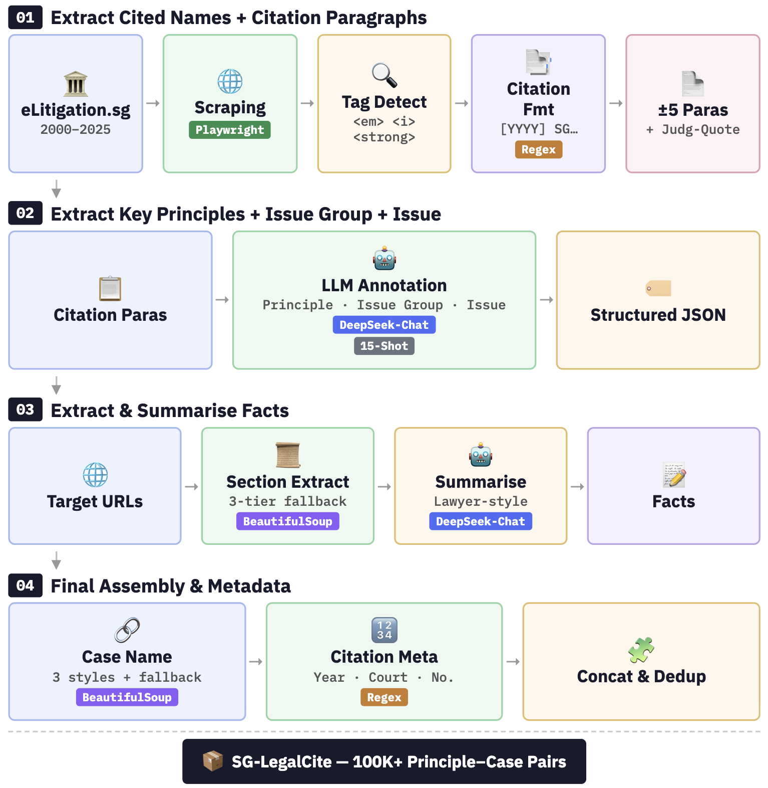

# SG-LegalCite: A Principle-Augmented Benchmark for Legal Citation Retrieval in Singapore Law

> **Paper:** *SG-LegalCite: A Principle-Augmented Benchmark for Legal Citation Retrieval in Singapore Law*
>
> **Dataset:** [HuggingFace](https://huggingface.co/datasets/anonymousmeowmeow/SG-LegalCite) | **Paper:** [[arXiv / ACL Anthology link]](#)

---

## Overview

SG-LegalCite is the **first legal citation retrieval benchmark for Singapore law** and the **first benchmark with principle-level query annotations** across all existing legal retrieval datasets.

Legal citation recommendation in common-law practice requires retrieving precedents that establish a specific **legal principle** — not merely cases with similar facts. SG-LegalCite operationalises this by formulating retrieval as:

> **[FACT]** *case facts* + **[PRINCIPLE]** *legal principle* → *cited case*

The dataset is extracted from 8,523 Singapore Supreme Court judgments (2000–2025) using a cost-effective LLM pipeline validated by legal experts from two Singapore law schools.

---

## Repository Structure

```
SG-LegalCite/
├── dataset/
│   └── README.md                  # Dataset format, field descriptions, and download link
├── code/
│   ├── extraction/
│   │   ├── 00_Generate_Case_Index.py         # Step 0: Generate master case URL index (2000–2025)
│   │   ├── 01_Extract_Cited_Cases_Batch.py   # Step 1: Extract cited cases + paragraph context
│   │   ├── 02_Deepseek_Chat_Batch.py         # Step 2: Extract Key Principles, Issue, Issue Group
│   │   ├── 03_Fact_Query_Batch.py            # Step 3: Generate lawyer-style Fact_Query summaries
│   │   ├── 04_Final_Concatenation_Batch.py   # Step 4: Add Case Name + Precedential Weight
│   │   ├── Scrape Cited Case Judgements Pipeline.py  # Scrape full judgment text for cited cases
│   │   ├── prompt_with_paragraphs_FINAL.txt  # 15-shot DeepSeek extraction prompt
│   │   ├── LLM_Selection/
│   │       ├── LLM_Selection_KeyPrinciples_All_Models.ipynb  # LLM comparison evaluation notebook
│   │       ├── LLM_Selection_KeyPrinciples_Results.xlsx      # Accuracy summary (Claude/DeepSeek/GPT-4o)
│   │       ├── Claude Sonnet 4_individual_key_principle_extraction_results/
│   │       ├── DeepSeek-V3_individual_key_principle_extraction_results/
│   │       └── GPT-4o_individual_key_principle_extraction_results/
│   │   └── Few-Shot Experiments (DeepSeek-Chat)/
│   │       ├── FewShot_Experiments_DeepSeek.ipynb            # Few-shot evaluation notebook
│   │       ├── FewShot_KeyPrinciples_Issue_Results.xlsx      # Accuracy summary (0/5/10/15/20-shot)
│   │       ├── Zero-Shot_individual_issue_extraction_results/
│   │       ├── Zero-Shot_individual_keyprinciple_extraction_results/
│   │       ├── 5-Shot_individual_issue_extraction_results/
│   │       ├── 5-Shot_individual_keyprinciple_extraction_results/
│   │       ├── 10-Shot_individual_issue_extraction_results/
│   │       ├── 10-Shot_individual_keyprinciple_extraction_results/
│   │       ├── 15-Shot_individual_issue_extraction_results/
│   │       ├── 15-Shot_individual_keyprinciple_extraction_results/
│   │       ├── 20-Shot_individual_issue_extraction_results/
│   │       └── 20-Shot_individual_keyprinciple_extraction_results/
│   ├── retrieval/
│   │   ├── generate_stage2_direct_pools_v2.py        # Pool generation: fact-only baseline
│   │   ├── generate_stage2_single_stage_pools_v2.py  # Pool generation: principle-augmented
│   │   ├── sbert_direct_v2v5.py                      # SBERT (fact-only)
│   │   ├── sbert_single_stage_v1.py                  # SBERT (principle-augmented)
│   │   ├── customlegalbert_direct_v1.py               # Custom Legal-BERT (fact-only)
│   │   ├── customlegalbert_single_stage_v1.py        # Custom Legal-BERT (principle-augmented)
│   │   ├── longformer_direct_v1.py                   # Legal-Longformer (fact-only)
│   │   ├── longformer_single_stage_v1.py             # Legal-Longformer (principle-augmented)
│   │   ├── pileoflaw_direct_v1.py                    # Pile-of-Law BERT (fact-only)
│   │   ├── pileoflaw_single_stage_v2.py              # Pile-of-Law BERT (principle-augmented)
│   │   ├── roberta_large_direct_v1.py                # Legal-English-RoBERTa (fact-only)
│   │   ├── roberta_large_single_stage_v1.py          # Legal-English-RoBERTa (principle-augmented)
│   │   ├── sailer_direct_v1.py                       # SAILER (fact-only)
│   │   ├── sailer_single_stage_v1.py                 # SAILER (principle-augmented)
│   │   ├── adaptllm_direct_v1.py                     # AdaptLLM (fact-only)
│   │   ├── adaptllm_single_stage_v2.py               # AdaptLLM (principle-augmented)
│   │   ├── legalbert_stage2_direct_v2.py             # Legal-BERT (fact-only)
│   │   ├── legalbert_single_stage.py                 # Legal-BERT (principle-augmented)
│   │   ├── saullm_direct_v2.py                       # SaulLM-7B (fact-only)
│   │   ├── saullm_single_stage_v1.py                 # SaulLM-7B (principle-augmented)
│   │   ├── lawma_direct_v3.py                        # Lawma-8B (fact-only)
│   │   ├── lawma_single_stage_v2.py                  # Lawma-8B (principle-augmented)
│   │   └── run_*.pbs                                 # PBS job scripts for HPC cluster
├── img/
│   ├── pipeline.png               # Dataset construction pipeline figure
│   ├── legal_hierarchy.png        # Legal citation conceptual structure
│   └── legal_hierarchy2.png       # Knowledge graph structure
├── .gitignore
└── README.md
```

---

## Dataset Statistics

| Attribute | Value |
|---|---|
| Time Span | 2000–2025 |
| Unique Judgments | 8,494 |
| Case–Principle Pairs | 100,554 |
| Unique Principles | 72,264 |
| Unique Cited Cases | 48,298 |
| Unique Issues | 86,247 |
| Unique Issue Groups | 9,712 |
| Avg. Raw Fact Length | 1,034.4 tokens |
| Avg. Fact Length (post-summary) | 45.1 tokens |
| Avg. Citation Paragraph Length | 1,100.5 tokens |
| Avg. Principle Length | 69.9 tokens |

Each record is a triplet **(f, k, c)**:
- **f** — Factual background of the citing judgment (LLM-summarised to ~45 tokens)
- **k** — Legal principle for which the precedent is cited
- **c** — Cited Singapore Supreme Court case

---

## Dataset Construction Pipeline



The pipeline consists of three main steps:

**Step 1 — Fact Extraction (`03_Fact_Query_Batch.py`)**
For each judgment, the factual section is located through rule-based heading detection (prioritising headings such as *Facts*, *Background*, *Introduction*, *Dispute*), with a fallback to the first 15 substantial paragraphs. DeepSeek-V3 (T=0.2, max 512 tokens) compresses the raw factual section (~1,034 tokens) into a 2–3 sentence lawyer-style `Fact_Query` (~45 tokens), a 23× compression.

**Step 2 — Citation and Context Extraction (`01_Extract_Cited_Cases_Batch.py`)**
Playwright + BeautifulSoup extract cited case names and ±5 surrounding paragraphs from eLitigation HTML. Cited case names are identified through styled HTML elements (e.g., `<em>`, `<i>`), validated against Singapore neutral citation patterns. No LLM involvement.

**Step 3 — Principle, Issue and Issue Group Extraction (`02_Deepseek_Chat_Batch.py`)**
DeepSeek-V3 (15-shot, T=0) extracts three fields per citation paragraph: (1) Key Principles Illustrated, (2) Issue Group, (3) Issue.

**Source code:** [`code/extraction/`](code/extraction/)

### LLM Selection (25 judgments, 725 case–principle pairs; 150 sampled for evaluation)

| Model | HSS | Cost/Case |
|---|---|---|
| Claude Sonnet 4 | 91.3% | $0.24 |
| **DeepSeek-V3** | **86.7%** | **$0.02** |
| GPT-4o | 84.7% | $0.16 |

DeepSeek-V3 was selected for full-scale extraction: 12× cost reduction for a 4.6 pp HSS difference. Total extraction cost: **$78.22**.

> HSS (Hybrid Similarity Score) is the equally weighted average of ROUGE (lexical overlap) and BERTScore (semantic similarity).

### Few-Shot Experiments (DeepSeek-V3)

| Examples | HSS (Issue) | HSS (Key Principles) |
|---|---|---|
| 0 (zero-shot) | 74.7% | 86.7% |
| 5 | 76.7% | 84.7% |
| 10 | 79.3% | 85.3% |
| **15** | **80.7%** | **86.7%** |
| 20 | 79.3% | 86.7% |

15-shot standardised for all extractions.

---

## Task Formulation

Citation recommendation is framed as nearest-neighbour retrieval over a Singapore-only candidate pool:

$$c^* = \arg\max_{c \in \mathcal{C}} \, s(q, c)$$

Two query settings are evaluated:

| Setting | Query | Description |
|---|---|---|
| **Fact-only** (f → c) | `f` | Facts only; mirrors existing benchmarks |
| **Principle-augmented** (f ⊕ k → c) | `[FACT] f [PRINCIPLE] k` | **Proposed formulation** |

---

## Experiments

### 1. Models Evaluated

**Conventional Lexical Baseline**

| Model | Type |
|---|---|
| BM25 | Lexical retrieval |

**Conventional Pre-trained Language Models**

| Model | Params | Pretraining Corpus |
|---|---|---|
| SBERT | 110M | General (MS-MARCO) |
| Legal-BERT | 110M | 12GB EU/UK/US legal text |
| Custom Legal-BERT | 110M | 37GB US case law |
| Legal-Longformer | 148M | 19GB multi-jurisdictional |
| Pile-of-Law BERT | 340M | 256GB US-focused legal sources |
| SAILER† | 110M | 10M+ Chinese judgments |
| Legal-English-RoBERTa | 337M | LexFiles multi-jurisdictional |

**Large-Scale Legal Language Models**

| Model | Params | Pretraining Corpus |
|---|---|---|
| AdaptLLM | 7B | US legal + reading comprehension |
| SaulLM-7B | 7B | US/EU/UK/AU legal data |
| Lawma-8B | 8B | US legal tasks |

> **Note:** SaulLM-54B was excluded due to GPU memory constraints. InternLM-Law was excluded due to model unavailability (HTTP 401). Lawyer GPT was excluded as no model weights were publicly released.

> **Jurisdiction gap:** All models were pretrained exclusively on China, US, UK, EU, or Australian legal data — none include Singapore legal text.

### 2. Training Setup

**Source code:** [`code/retrieval/`](code/retrieval/)

Fine-tuning uses symmetric InfoNCE contrastive loss:

$$\mathcal{L} = \frac{1}{2} \left( \mathcal{L}_{k \to c} + \mathcal{L}_{c \to k} \right)$$

**Data split:** 80/10/10 (train/val/test), split by unique judgment URL to prevent data leakage.

**Training parameters:**

| Parameter | Value |
|---|---|
| Batch size | 64 |
| Learning rate | 2e-5 |
| Temperature τ | 0.07 (learnable) |
| Checkpoint selection | Min. validation loss |
| Random seed | 42 |

All experiments conducted on NVIDIA A100 GPUs (80GB).

### 3. Results

Retrieval performance on SG-LegalCite (1000-way candidate pool). Relative gains (%) are computed against the corresponding fact-only setting for the same model.

| Model | Fact-only MRR | Fact-only R@1 | PA MRR | PA R@1 | PA R@5 | PA R@10 | PA R@20 |
|---|---|---|---|---|---|---|---|
| *Conventional Lexical* | | | | | | | |
| BM25 | 1.8 | 0.6 | 3.2 (+79%) | 2.0 (+221%) | 3.5 | 4.7 | 6.6 |
| *Conventional PLMs* | | | | | | | |
| SBERT | 10.5 | 4.7 | 20.9 (+99%) | 12.9 (+174%) | 27.8 | 36.3 | 45.8 |
| Legal-BERT | 6.2 | 2.2 | 14.1 (+128%) | 7.1 (+228%) | 19.6 | 27.5 | 37.5 |
| Custom Legal-BERT | 6.1 | 2.1 | 9.2 (+51%) | 4.0 (+90%) | 12.4 | 18.9 | 27.4 |
| Legal-Longformer | 6.8 | 2.6 | 10.0 (+47%) | 4.4 (+69%) | 13.9 | 20.9 | 29.9 |
| Pile-of-Law BERT | 5.7 | 2.0 | 12.4 (+118%) | 5.8 (+190%) | 17.5 | 25.5 | 35.2 |
| SAILER† | 0.8 | 0.1 | 0.9 (+13%) | 0.2 (+100%) | 0.6 | 1.2 | 2.0 |
| Legal-en-RoBERTa | 6.9 | 2.6 | 9.4 (+36%) | 3.8 (+46%) | 13.0 | 20.0 | 29.6 |
| *Large-scale Legal LMs* | | | | | | | |
| AdaptLLM | 11.6 | 5.3 | 29.5 (+154%) | 17.9 (+238%) | 41.6 | 53.5 | 64.9 |
| **SaulLM-7B** | **13.0** | **5.9** | **38.2 (+194%)** | **24.4 (+314%)** | **54.2** | **66.7** | **77.2** |
| Lawma-8B | 10.0 | 4.0 | 30.5 (+205%) | 18.2 (+355%) | 43.8 | 56.6 | 68.6 |

> PA = Principle-Augmented query setting. † SAILER's structure-aware pre-training causes embedding collapse on SG legal text; fine-tuning provides no meaningful improvement.

---

## Key Findings

**1. Large-scale legal language models consistently outperform smaller conventional models** across both query settings. A clear performance hierarchy exists: large-scale legal LMs (e.g., SaulLM-7B) achieve the strongest results, followed by conventional pre-trained language models (e.g., SBERT), with BM25 performing weakest. This suggests legal citation retrieval benefits substantially from both model scale and domain-specific pre-training.

**2. Principle-augmented retrieval consistently outperforms fact-only retrieval** across nearly all models and all model categories — including lexical baselines, conventional PLMs, and large-scale legal LMs. On average, principle-augmented queries improve MRR by 111% and Recall by 124% across all approaches, confirming that explicit legal principles provide strong discriminative signals for citation retrieval.

**3. Large-scale legal language models benefit more from principle augmentation than conventional models.** On average, our paradigm improves MRR by 79%, 70%, and 184% across the three model categories respectively. The performance gap widens under principle-augmented queries, indicating that stronger models exploit principle-level semantics more effectively. SaulLM-7B achieves the top scores across all metrics after augmentation.

**4. SBERT unexpectedly outperforms all legal-specific conventional models.** SBERT consistently surpasses all legal-specific encoders under both query settings, suggesting that domain-specific pre-training does not always transfer well across legal systems. A robust general semantic representation can be more transferable than small legal-specialised models when cross-jurisdiction semantic mismatch is present.

**5. Recall@k gains decrease consistently as k increases.** Gains are largest at R@1 and gradually decrease as k increases to 5, 10, and 20 (average gains of 184% → 106% → 80% → 60% for k = 1, 5, 10, 20), indicating that principle-augmented queries are particularly effective at placing the correct cited case at the very top rank.

---

## Reproducibility Notes

**Unavailable models:** The following models could not be included in the evaluation:
- **SaulLM-54B**: Excluded due to GPU memory constraints.
- **InternLM-Law** (`internlm/internlm2-law-7b`): HuggingFace weights returned HTTP 401 errors at time of experiments.
- **Lawyer GPT**: No publicly released model weights despite the published paper.

These barriers are noted to highlight reproducibility challenges in legal NLP.

---

## Citation

If you use SG-LegalCite in your work, please cite:
```bibtex
@inproceedings{anonymous2026sglegalcite,
  title  = {SG-LegalCite: A Principle-Augmented Benchmark for Legal Citation Retrieval in Singapore Law},
  author = {Anonymous Authors},
  year   = {2026}
}
```

---

## License

The dataset is released under [CC BY 4.0](https://creativecommons.org/licenses/by/4.0/). Source judgments are publicly available via the [Singapore eLitigation platform](https://www.elitigation.sg).

Code is released under the MIT License.

---

## Acknowledgements

AI coding assistants (e.g., ChatGPT) were used to support code development for the data extraction pipeline and model training, as well as manuscript polishing. All scientific design, methodology, and analysis are the authors' own work.

Expert validation was conducted by legally qualified annotators from two Singapore law schools. Experiments were run on a university HPC cluster (A100 GPUs).
